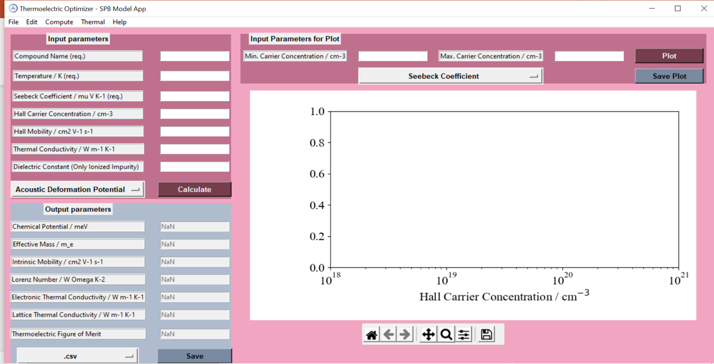

# SPB Thermoelectric Optimizer
SPB Thermoelectric Optimizer - GUI to determine optimized carrier concentrations

With this GUI the optimize carrier concentration can be computed using a single parabolic band approach. Because the charge carrier transport can be limited by multiple scattering mechanisms, the controller can choose the scattering mechanism (i.e., acoustic deformation potential, polar optical phonon, and ionized impurity scattering). 

To launch the app, please download all files and read Thermoelectric Optimizer-SPB Model Python for more instructions.

## Thermoelectric Performance
Compute the thermoelectric parameters as function of the carrier concentration using empirical data.

## Temperature-Dependence Thermoelectric Performance
The thermoelectric performance can also be computed as function of temperature and carrier concentration.

